# TeamSync — Team Task Management System

TeamSync is a collaborative team-task management system designed to help teams organize **tasks**, **schedules**, and **project activities** in one place. It combines task assignment, progress tracking, and **calendar-based planning** so teams can clearly visualize workloads, avoid missed deadlines, and keep collaboration efficient.

## Project description

**Problem addressed**

- Tasks are not clearly assigned to responsible members
- Team members may miss deadlines
- Project schedules are not clearly visualized
- Communication about task updates becomes inefficient

**What TeamSync provides**

- Task creation, assignment, and progress tracking
- Calendar scheduling with time ranges / events
- Notes and collaboration around tasks/events
- Role-based access control (Admin / Team Manager / Team Member)

## System architecture overview

This repository is implemented as a **Next.js (App Router)** web app. “Backend” functionality is provided via **Next.js API Route Handlers** under `src/app/api/*`, and data/auth are handled by **Supabase** (PostgreSQL + Auth).

**High-level architecture**

- **Client UI**: Next.js + React components (`src/components/*`, `src/app/*`)
- **API layer**: Next.js route handlers (`src/app/api/*`)
- **Auth**: Supabase Auth via `@supabase/ssr` (cookie/session-based)
- **Database**: PostgreSQL (Supabase) for tasks, teams, events, roles, etc.

**Typical flow**

1. User signs up / logs in (Supabase Auth).
2. App reads user session on server routes and pages.
3. API routes validate membership/roles (for team-scoped actions).
4. API routes read/write Postgres tables through Supabase.
5. UI renders tasks and calendar views from API responses.

## User roles & permissions

TeamSync supports **3 roles**:

### Administrator

- **Responsibilities**: Manage system configuration, users/roles, oversee all teams/projects
- **Permissions**:
  - Create/remove users
  - Assign user roles
  - View and modify all tasks
  - Access system analytics

### Team Manager

- **Responsibilities**: Manage team tasks and schedules, assign tasks, monitor progress
- **Permissions**:
  - Create / edit / assign / update / view team tasks
  - Create calendar events

### Team Member

- **Responsibilities**: Complete assigned tasks, update progress, manage personal schedules
- **Permissions**:
  - View / update / comment on assigned tasks
  - View / add notes to calendar events

## Technology stack

- **Frontend**: Next.js (React), Tailwind CSS, shadcn/ui
- **Backend/API**: Next.js Route Handlers (`src/app/api/*`)
- **Database**: PostgreSQL (Supabase)
- **Authentication**: Supabase Auth (session/cookies via `@supabase/ssr`)
- **Deployment**: Vercel (recommended for Next.js)

## Installation & setup instructions

### Prerequisites

- Node.js (LTS recommended)
- A Supabase project (PostgreSQL + Auth)

### 1) Install dependencies

```bash
npm install
```

### 2) Configure environment variables

Create a `.env.local` file at the project root:

```env
NEXT_PUBLIC_SUPABASE_URL=https://vuyfydtnvxzyclzchpfe.supabase.co
NEXT_PUBLIC_SUPABASE_PUBLISHABLE_KEY=sb_publishable_Y-8z-TKgx-dVEr3nlDpsfg_z9UicZMy

SUPABASE_AUTH_EXTERNAL_GOOGLE_CLIENT_SECRET=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
```

Where to find these in Supabase:

- **Project URL**: Supabase Dashboard → Project Settings → API
- **Publishable/Anon key**: Supabase Dashboard → Project Settings → API
- **Service role key**: Supabase Dashboard → Project Settings → API (keep secret; never expose to the client)

## How to run the system

### Development

```bash
npm run dev
```

Then open `http://localhost:3000`.

### Production build

```bash
npm run build
npm run start
```

### Lint

```bash
npm run lint
```

## Screenshots

### Landing & Authentication

| Landing Page | Login | Sign Up |
|---|---|---|
| 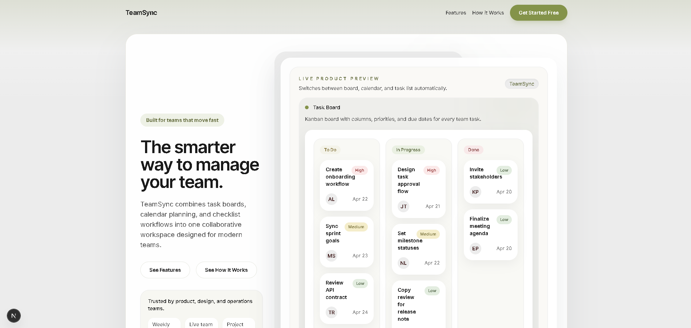 | 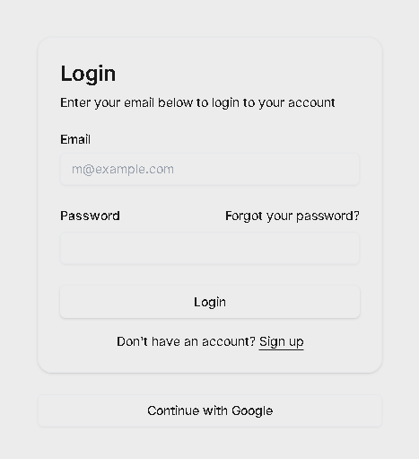 | 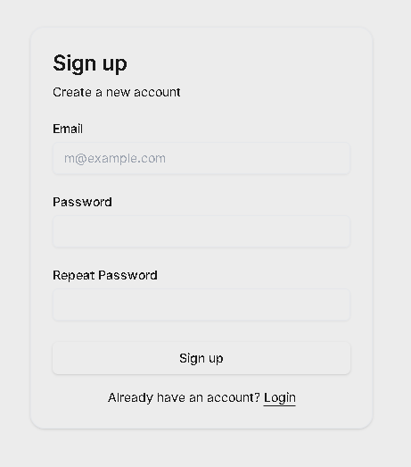 |

### Main Features

| Dashboard | Task Board | Task List |
|---|---|---|
| 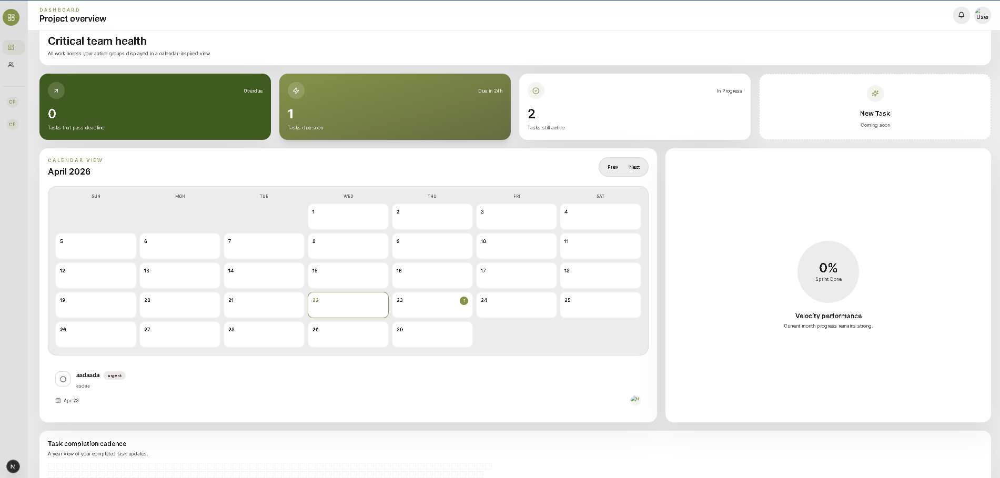 | 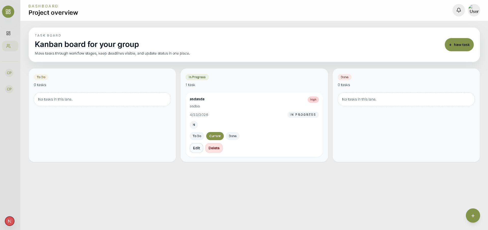 | 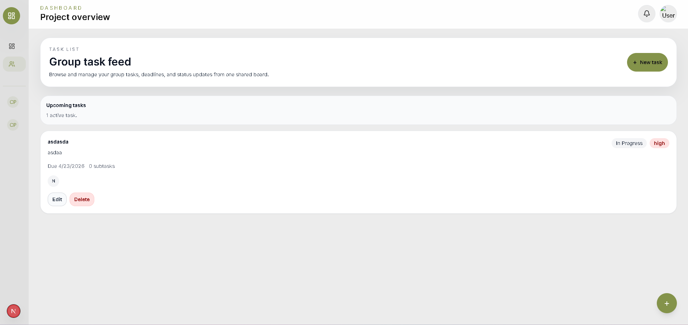 |

### Collaboration & Planning

| Group | Calendar | New Task |
|---|---|---|
| 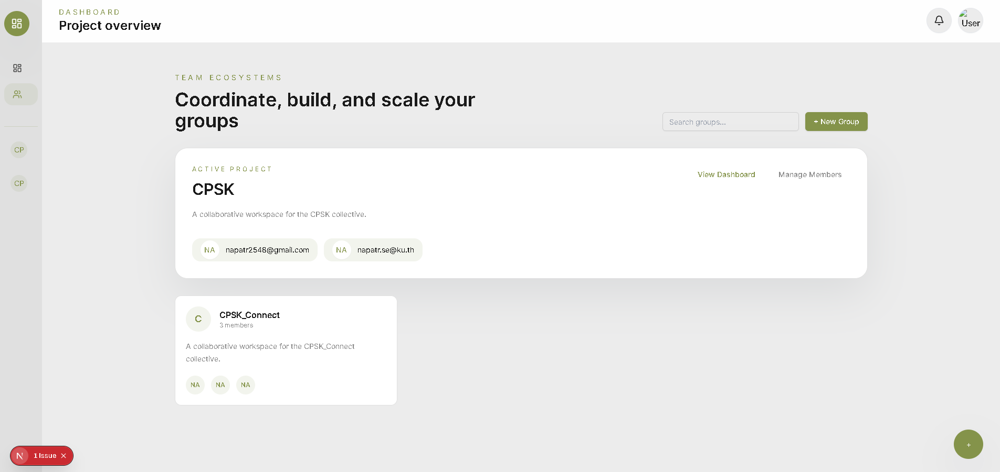 | 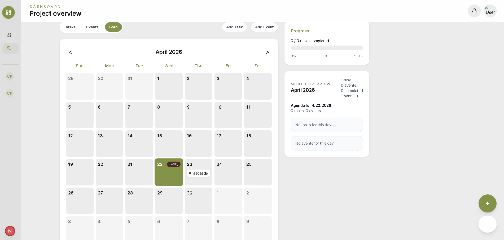 | 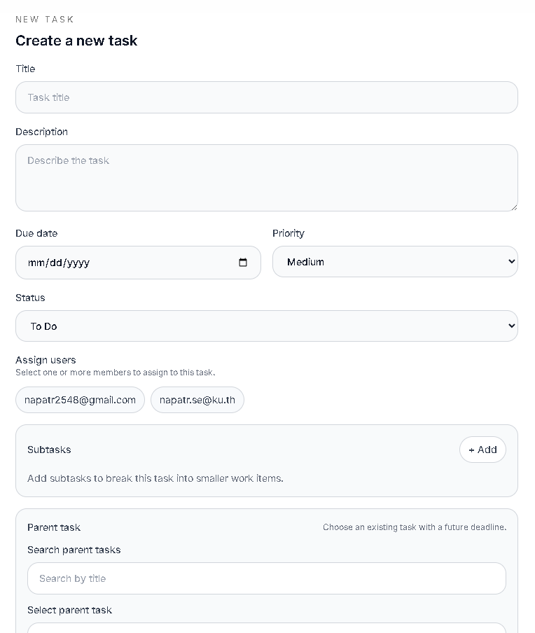 |

### Codebase Overview

| Code Structure | Code Charta |
|---|---|
| 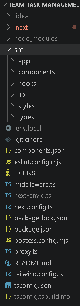 | 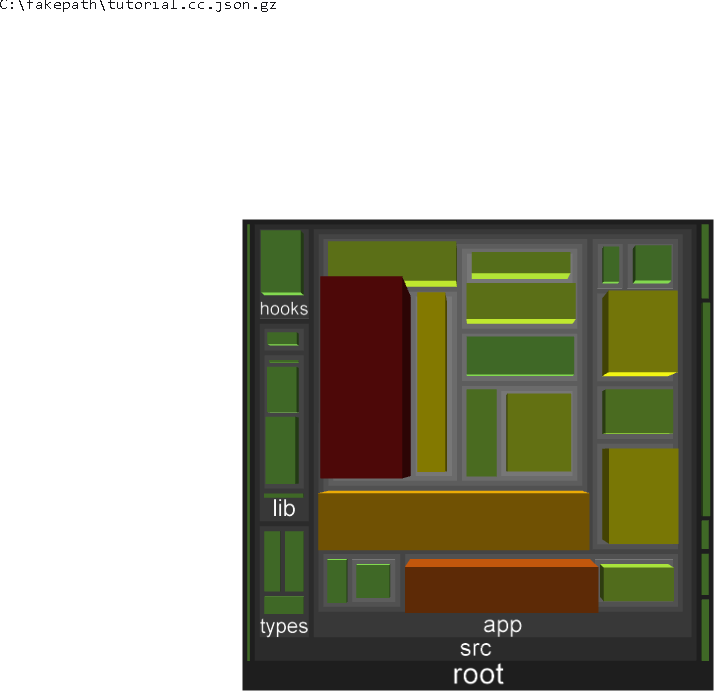 |
